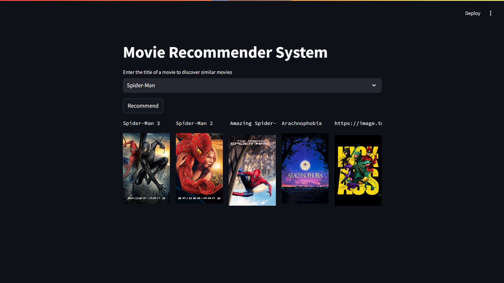

# Movie Recommendation System




In this project, I have made a content-based movie recommendation system that recommends movies to the user based on the movies that they currently like via a search toggle bar.

## Types of Recommendation Systems
1. **Content-based**: Based on user tags. Tags are interests, for example, genre, country, etc.
2. **Collaborative**: Based on the similarity of the user. Content is suggested from one user to another. For example, if I like Stephen Curry's basketball match and you also follow Stephen Curry, then that video will also be shown (recommended) to you.
3. **Hybrid**: Content-based + Collaborative. For example, I like to see basketball clips, which will be shown to me only, and my friend and I watch piano videos; if he likes a Hindi piano cover, then that will also be shown to me.

Mostly, huge MNCs use hybrid recommendation systems, but I have seen startups using content-based and collaborative systems as they are cheaper or easier to make. In this project, I'll be making a content-based recommendation system as it makes sense - similar content is most likely to be watched by the consumer.

## Project Architecture
The project is divided mainly into three parts:
1. **Frontend**: The frontend is made using Streamlit API to make the frontend of the web app that consists of the heading and the search bar.
2. **Backend**: The backend of the web app is running on a Heroku server (You can use Apache to use your local machine as the server or Streamlit subscription to deploy the web app).
3. **ML System**: I used Python and ML tools from scikit-learn, which I will talk about in depth shortly in the later part of this document.

## Dataset
Find the entire dataset here (9MB): [TMDB 5000 Movie MetaData](https://www.kaggle.com/datasets/tmdb/tmdb-movie-metadata)

## Importance of a Recommender System
Let me explain to you the importance of a recommender system in the real world. I want you to think that you own a shoe retail store in Koregaon Park, India. There's a lot of competition in Koregaon Park for shoe vendors as there are a lot of them and many are well-reputed. You want your store to be a one-stop destination. Imagine I come to your store, and my shoe size is UK12. I ask you for basketball shoes. You show me five pairs of shoes, and you see that I like the red Precision 6 shoes very much, but I already have them. What would you do as the owner of that shop? You would show me more types of `UK12` shoes that are `red` because I showed interest in red shoes. This is what a recommender system does on big websites like Amazon, Netflix, etc., because customer acquisition is very important. Also, these recommender systems are crucial to the company because the attention span of consumers is reducing when it comes to online shopping. Showing the most right product at the right time is very important for sales. In the example above, red and UK12 are the tags. The ML Algorithm uses these tags to identify similar products and create a confidence rate. The product with the highest confidence rate is shown. In this project, the tags are movie director, actor, movie name, genre, type, etc., that help the ML Algorithm understand the similarities between the movies.

## The Project
### ML Algorithm
1. **Data Extraction**: I used the pandas library for data extraction and seaborn to visualize it where I realized the majority of the movies are in English.
2. **Feature Selection**: genre, id, keywords, title, overview, cast, crew.
3. **Data Preprocessing**: The entire data was preprocessed into title and tags where tags = overview + genres + keywords + cast + crew.
4. **Vectorization**: Conversion of texts into words (text-vectorization).
5. **Prediction**: Prediction of similar movies is made using vectorization.

### Frontend
- The frontend is developed using Streamlit.

### Backend
- You can deploy the website easily on the backend server using the following SAAS platforms:
    1. [Heroku](https://devcenter.heroku.com/categories/deployment)
    2. [Streamlit](https://docs.streamlit.io/deploy/streamlit-community-cloud/deploy-your-app)
    3. [Apache Deployment](https://www.youtube.com/watch?v=vpBJnXkQZiw&ab_channel=JoachimHenrikB%C3%BClow)

## Cosine Similarity in Vectorization
Cosine similarity is a measure used to determine how similar two vectors are irrespective of their size. Mathematically, it measures the cosine of the angle between two vectors projected in a multi-dimensional space. The cosine similarity is particularly useful in text analysis, information retrieval, and recommendation systems.

### How Cosine Similarity Works:


1. **Vectorization**: Text data is first converted into vectors. Each document or text is represented as a vector of features (like words or terms). This process is called text vectorization.
    - Example: "Action movie with superheroes" might be vectorized based on word counts or TF-IDF scores.
2. **Dot Product**: Calculate the dot product of the two vectors.
    - If vectors A and B are [A1, A2, ..., An] and [B1, B2, ..., Bn], then the dot product is: \( A \cdot B = \sum_{i=1}^{n} A_i \cdot B_i \)
3. **Magnitude**: Calculate the magnitude (length) of each vector.
    - The magnitude of vector A: \( \|A\| = \sqrt{\sum_{i=1}^{n} (A_i)^2} \)
    - The magnitude of vector B: \( \|B\| = \sqrt{\sum_{i=1}^{n} (B_i)^2} \)
4. **Cosine Similarity Calculation**: Use the dot product and magnitudes to calculate the cosine similarity.
    - Cosine Similarity: \( \cos(\theta) = \frac{A \cdot B}{\|A\| \|B\|} \)
    - This results in a value between -1 and 1, where 1 means the vectors are identical, 0 means they are orthogonal (no similarity), and -1 means they are diametrically opposed.


### Example:
Let's say we have two vectors A and B:
- Vector A (representing Movie 1): [1, 1, 0, 0, 1, 0, 1]
- Vector B (representing Movie 2): [0, 1, 0, 1, 0, 1, 1]

1. **Dot Product**: \( 1 \cdot 0 + 1 \cdot 1 + 0 \cdot 0 + 0 \cdot 1 + 1 \cdot 0 + 0 \cdot 1 + 1 \cdot 1 = 1 + 1 = 2 \)
2. **Magnitude of A**: \( \sqrt{1^2 + 1^2 + 0^2 + 0^2 + 1^2 + 0^2 + 1^2} = \sqrt{4} = 2 \)
3. **Magnitude of B**: \( \sqrt{0^2 + 1^2 + 0^2 + 1^2 + 0^2 + 1^2 + 1^2} = \sqrt{4} = 2 \)
4. **Cosine Similarity**: \( \cos(\theta) = \frac{2}{2 \cdot 2} = \frac{2}{4} = 0.5 \)

A cosine similarity of 0.5 indicates a moderate similarity between the two movie vectors.

Got it! Here's the addition with the steps to copy the repository:

---

## To copy this repository

To get a local copy of this project up and running, follow these simple steps:

1. **Clone the repository**
   ```bash
   git clone https://github.com/aryanc381/Movie-Recommendation-System.git
   ```

2. **Navigate to the project directory**
   ```bash
   cd Movie-Recommendation-System
   ```

3. **Install the required dependencies**
   ```bash
   pip install -r requirements.txt
   ```

4. **Run the application**
   ```bash
   streamlit run app.py
   ```

This will start the Streamlit app, and you can interact with the movie recommendation system through your web browser.

## Conclusion
This project demonstrates the creation of a content-based movie recommendation system using vectorization and cosine similarity. The system recommends movies based on the user's interests by analyzing the similarity between movie tags. The project is designed with a Streamlit frontend, a Heroku (or other) backend, and utilizes scikit-learn for machine learning algorithms.

You can find the complete project on [GitHub](https://github.com/aryanc381/Movie-Recommendation-System).

Sure, here's the addition:

---

**Note:** If you want to copy or contribute to this repository, please feel free to fork the repository on GitHub and make your changes. Contributions are welcome, and if you have any doubts let me know at ```venomc381@gmail.com```
